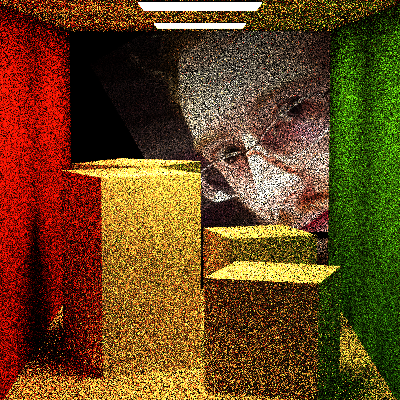
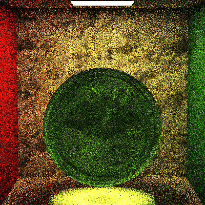
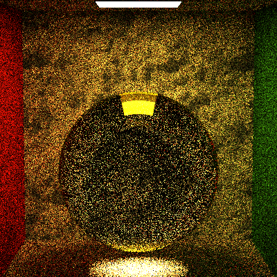
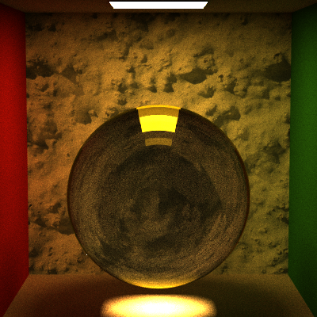
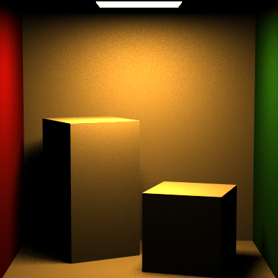
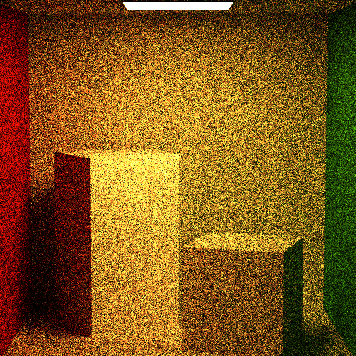
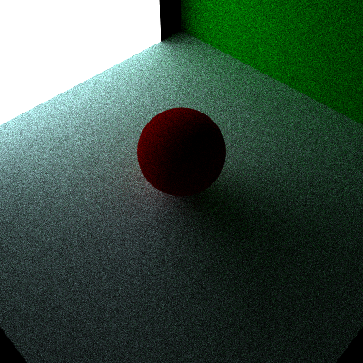

Jiarui Yan(jiaruiya) HW5 Test Result:
======================
Thinking:
-------------
Direct lighting integrator is clearer than naive integrator, because direct lighting integrator directly finds light, while navie integrator may lost a light after its bounce number is larger than limitation.

Thus, direct light may provide fake information of the scene, which makes the rendered result clear. 

However, naive integrator would just discard that information. Theoretically, naive integrator should be more accurate.

SpecularBRDF:
-------------

SpecularBTDF:
-------------

FresnelDielectric:
------------

Direct Lighting:
------------

Naive Integrator:
------------

Extra Credit:
------------
### 1. Shpere sample;
### 2. FresnelConductor;
### 3. Spectrum class:

TIP: By using commented-out code in Navie-Integrator to get result from Specutrm calculation.

